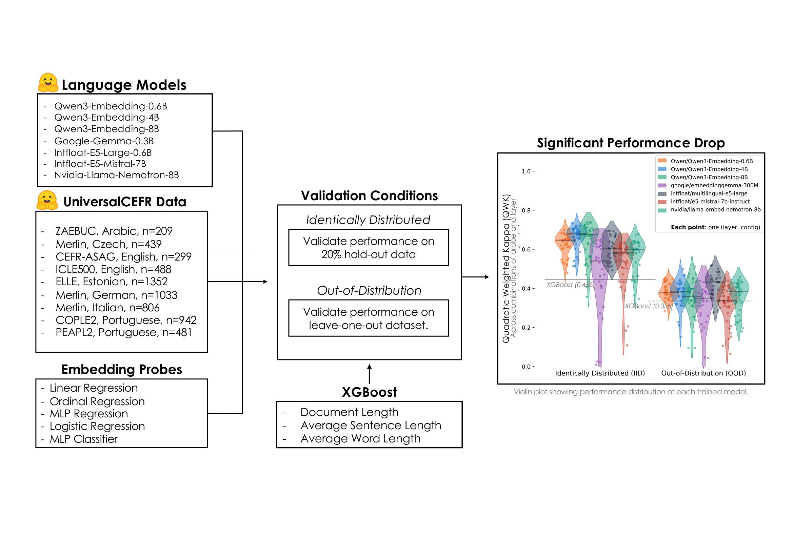

# Replication repository for COLM2026 conference paper:
### [Multilingual Embedding Probes Fail to Generalize Across Learner Corpora](https://arxiv.org/abs/2604.07095)

## 🔍 Overview

This repository contains an csv-file with the selected datasets from [UniversalCEFR](https://huggingface.co/UniversalCEFR) found @ [.src/data/combined_cefr_data.csv](src/data/combined_cefr_data.csv)

The predicted results from the respective probes of each LLM can be found in [.src/results/*.csv](.src/results/)

For a complete reproduction of results see the guide [Reproduction]

## Reprodcution Guide:
1. Embed data with chosen models and save cache with [scripts/get_activations.py](./scripts/get_activations.py) 
2. Fit probes to activations in both conditions with [scripts/fit_probe_LOO_IID.py](./scripts/fit_probe_LOO_IID.py)
3. Fit XGBoost baseline-model with [scripts/fit_XGB_surface.py](./scripts/fit_XGB_surface.py)
4. Plot trendline and violin plots with [scripts/plot_general.py](./scripts/plot_general.py)
5. Plot residual ridgeplots with [scripts/plot_residuals.py](./scripts/plot_residuals.py)